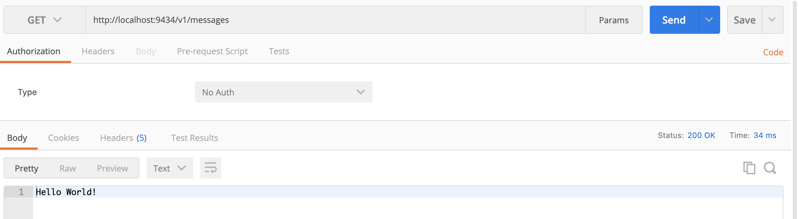

# Result
1. Get 
2. Post 
3. Delte 

# End Point Description

1. GET
   The GET method is used to retrieve data from the server. This is a read-only method, so it has no risk of mutating or corrupting the data. For example, if we call the get method on our API, we’ll get back a String of "Hello World" inside the getMessages() methoods and on the server side it will generate log of "[Uba] v1/messages Get method is called". 

*Important thing to keep in mind:

Since a GET request is only requesting data and not modifying any resources, it’s considered a safe and idempotent method.

*Properties:

2. POST
   The POST method sends data to the server and creates a new resource. The resource it creates is subordinate to some other parent resource. When a new resource is POSTed to the parent, the API service will automatically associate the new resource by assigning it an ID (new resource URI). In short, this method is used to create a new data entry. But on our API it will only retrun string of "Hello World" since it declared in postMessages() methood.

*Important thing to keep in mind:

In web services, POST requests are used to send data to the API server to create or update a resource. The data sent to the server is stored in the request body of the HTTP request.
When a new resource is POSTed to the server, the API service will automatically associate the new resource by assigning it an ID (new resource URI). In short, this method is used to create a new data entry.
The simplest example is a contact form on a website. When you fill out the inputs in a form and hit Send, that data is put in the response body of the request and sent to the server. This may be JSON, XML, or query parameters (there’s plenty of other formats, but these are the most common).
It’s worth noting that a POST request is non-idempotent. It mutates data on the backend server (by creating or updating a resource), as opposed to a GET request which does not change any data.

*Properties:

3. DELETE
   The DELETE method is used to delete a resource specified by its URI. But this is not guaranted, especialy when resouce not found. Since the method is only return the string of "Hello world" in body.

*Important thing to keep in mind:

The DELETE method is exactly as it sounds:delete the resource at the specified URL. This method is one of the more common in RESTful APIs so it's good to know how it works.
If a new user is created with a POST request to/users, and it can be retrieved with a GET request to /users/{{userid}}, then making a DELETE request to /users/{{userid}} will completely remove that user.

*Properties:

Source:
https://www.baeldung.com/rest-http-put-vs-post
https://www.rfc-editor.org/rfc/rfc2616#page-53
https://medium.com/@9cv9official/what-are-get-post-put-patch-delete-a-walkthrough-with-javascripts-fetch-api-17be31755d28

